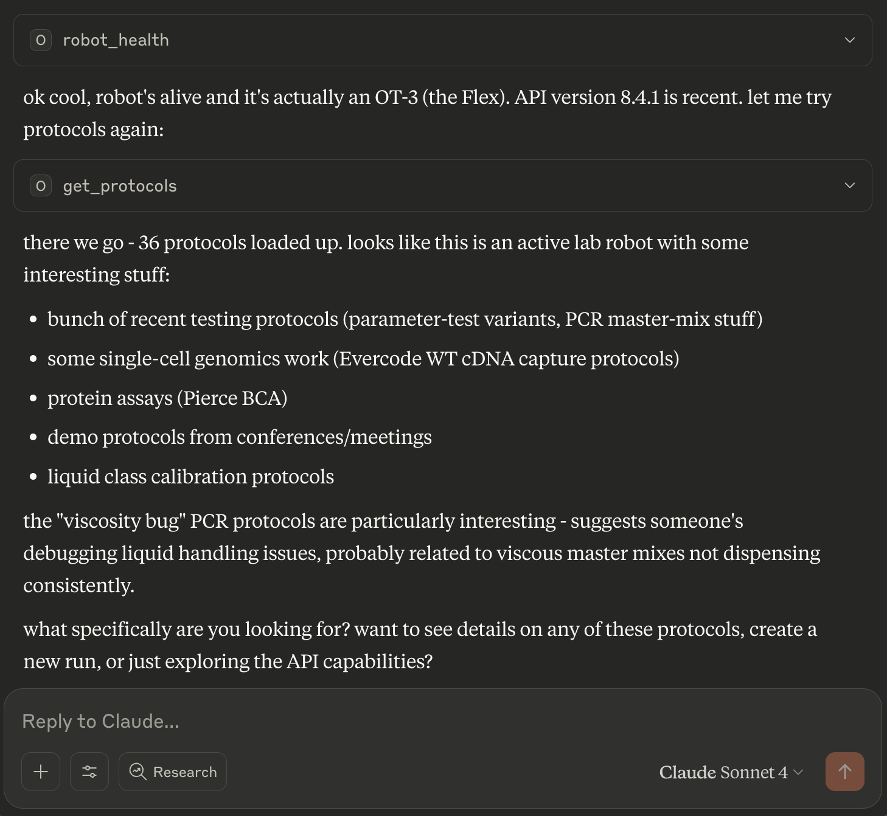

# Opentrons MCP Server

A Model Context Protocol (MCP) server for Opentrons robot automation and API documentation. This tool provides both comprehensive API documentation and direct robot control capabilities for Opentrons Flex and OT-2 robots.

<a href="https://glama.ai/mcp/servers/@yerbymatey/opentrons-mcp">
  
</a>

## Features

### API Documentation Tools
- **Search Endpoints**: Find API endpoints by functionality, method, or keyword
- **Endpoint Details**: Get comprehensive information about specific API endpoints
- **Category Browsing**: List endpoints by functional category
- **API Overview**: High-level overview of the entire Opentrons HTTP API

### Robot Automation Tools
- **Protocol Management**: Upload, list, and manage protocol files
- **Run Control**: Create runs, start/stop execution, monitor progress
- **Robot Health**: Check connectivity and system status
- **Hardware Control**: Home robot, control lights, and basic operations

## Installation

### From npm (recommended)
```bash
npm install -g opentrons-mcp
```

### From source
```bash
git clone https://github.com/yerbymatey/opentrons-mcp.git
cd opentrons-mcp
npm install
```

## Configuration

Add to your Claude Desktop configuration file:

**macOS**: `~/Library/Application Support/Claude/claude_desktop_config.json`  
**Windows**: `%APPDATA%\Claude\claude_desktop_config.json`

```json
{
  "mcpServers": {
    "opentrons": {
      "command": "opentrons-mcp",
      "args": []
    }
  }
}
```

If installed from source:
```json
{
  "mcpServers": {
    "opentrons": {
      "command": "node",
      "args": ["/path/to/opentrons-mcp/index.js"]
    }
  }
}
```

## Available Tools

### Documentation Tools

#### search_endpoints
Search Opentrons HTTP API endpoints by functionality, method, path, or keyword.
- `query` (required): Search term
- `method` (optional): Filter by HTTP method (GET, POST, PUT, DELETE, PATCH)
- `tag` (optional): Filter by API category
- `include_deprecated` (optional): Include deprecated endpoints

#### get_endpoint_details
Get comprehensive details about a specific API endpoint.
- `method` (required): HTTP method
- `path` (required): API endpoint path

#### list_by_category
List all endpoints in a specific functional category.
- `category` (required): API category (Health, Control, Protocol Management, etc.)

#### get_api_overview
Get high-level overview of the Opentrons HTTP API structure and capabilities.

### Automation Tools

#### upload_protocol
Upload a protocol file to an Opentrons robot.
- `robot_ip` (required): Robot IP address
- `file_path` (required): Path to protocol file (.py or .json)
- `protocol_kind` (optional): "standard" or "quick-transfer" (default: "standard")
- `key` (optional): Client tracking key
- `run_time_parameters` (optional): Runtime parameter values

#### get_protocols
List all protocols stored on the robot.
- `robot_ip` (required): Robot IP address
- `protocol_kind` (optional): Filter by protocol type

#### create_run
Create a new protocol run on the robot.
- `robot_ip` (required): Robot IP address
- `protocol_id` (required): ID of protocol to run
- `run_time_parameters` (optional): Runtime parameter values

#### control_run
Control run execution (play, pause, stop, resume).
- `robot_ip` (required): Robot IP address
- `run_id` (required): Run ID to control
- `action` (required): "play", "pause", "stop", or "resume-from-recovery"

#### get_runs
List all runs on the robot.
- `robot_ip` (required): Robot IP address

#### get_run_status
Get detailed status of a specific run.
- `robot_ip` (required): Robot IP address
- `run_id` (required): Run ID to check

#### robot_health
Check robot health and connectivity.
- `robot_ip` (required): Robot IP address

#### control_lights
Turn robot lights on or off.
- `robot_ip` (required): Robot IP address
- `on` (required): true to turn lights on, false to turn off

#### home_robot
Home robot axes or specific pipette.
- `robot_ip` (required): Robot IP address
- `target` (optional): "robot" for all axes, "pipette" for specific mount
- `mount` (optional): "left" or "right" (required if target is "pipette")

## Usage Examples

### With Claude Desktop


*Screenshot showing the Opentrons MCP server in action with Claude Desktop after asking for current protocols with opentrons for the Flex, give it the robot ip!*

Once configured, you can use natural language to control your robot:

**Upload a protocol:**
```
Upload the protocol file at /path/to/my_protocol.py to my robot at 192.168.1.100
```

**Check robot status:**
```
Check if my robot at 192.168.1.100 is healthy and ready
```

**Run a protocol:**
```
List all protocols on my robot, then create and start a run for the latest one
```

**Monitor progress:**
```
Show me the status of run abc123 on my robot
```

### Programmatic Usage

```javascript
import { Client } from "@modelcontextprotocol/sdk/client/index.js";

// Connect to MCP server
const client = new Client(/* transport */);

// Upload protocol
await client.request({
  method: "tools/call",
  params: {
    name: "upload_protocol",
    arguments: {
      robot_ip: "192.168.1.100",
      file_path: "/path/to/protocol.py",
      protocol_kind: "standard"
    }
  }
});
```

## Requirements

- Node.js 18+
- Opentrons robot with HTTP API enabled (port 31950)
- Network connectivity between client and robot

## Robot Setup

Ensure your Opentrons robot is:
1. Connected to the same network as your client
2. Running robot software version 7.0.0+
3. Accessible on port 31950 (default for HTTP API)

You can verify connectivity by visiting `http://your-robot-ip:31950/health` in a browser.

## API Reference

This tool provides access to the complete Opentrons HTTP API, including:

- **Protocol Management**: Upload, analyze, and manage protocol files
- **Run Management**: Create, control, and monitor protocol runs  
- **Hardware Control**: Robot movement, homing, lighting, and calibration
- **System Management**: Health monitoring, settings, and diagnostics
- **Module Control**: Temperature modules, magnetic modules, thermocyclers
- **Data Management**: CSV files for runtime parameters

For detailed API documentation, use the search and documentation tools provided by this MCP server.

## Troubleshooting

### Cannot connect to robot
- Verify robot IP address is correct
- Ensure robot is powered on and connected to network
- Check that port 31950 is accessible
- Confirm robot software is running

### Protocol upload fails
- Verify file path exists and is readable
- Ensure protocol file is valid Python (.py) or JSON format
- Check available disk space on robot
- Confirm protocol is compatible with robot type (OT-2 vs Flex)

### Run execution issues
- Verify all required labware and modules are attached
- Check robot calibration status
- Ensure protocol analysis completed successfully
- Confirm no hardware errors or conflicts

## Contributing

Contributions are welcome! Please feel free to submit issues and pull requests.

## License

No license go brazy

## Related Projects

- [Opentrons API Documentation](https://docs.opentrons.com)
- [Model Context Protocol](https://modelcontextprotocol.io)
- [Claude Desktop](https://claude.ai/desktop)